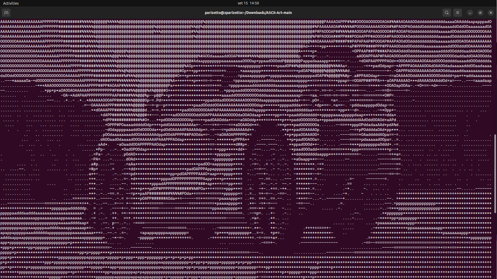

# ASCII-Art
## Welcome 👋




## Run the application

**Clone the repository**
```bash
git clone https://github.com/gparizotto/ascii-art.git
```
**Go into the directory**
```
cd ascii-art
```
**Compile the file you want to run**
```
./comp.sh image.cpp
```
```
./comp.sh video.cpp
```
** Run the application**
```
./image
```
```
./video
```

## Introduction
I've harnessed the power of OpenCV to create a unique tool that transforms ordinary images and videos into captivating ASCII art. The application dynamically resizes images to match your terminal's row and column dimensions, creating a grid of cells for efficient processing. Each cell calculates the average RGB value of its corresponding pixels, resulting in an impressive grayscale representation of the original image. Finally, the algorythm populates each cell based on its grayscale intensity.

```cpp
for(int i = 0; i < rows; i++) {
    for(int j = 0; j < cols; j++) {
      long long int sum = 0;

      for(int x = i * CellSizeWidth; x < (i + 1) * CellSizeWidth; x++) {
        for(int y = j * CellSizeWidth; y < (j + 1) * CellSizeWidth; y++) {
          sum += image.at<uchar>(x, y);
        }
      }

      double average = static_cast<double>(sum) /CellArea; 
      int index = characters.size() * (int)average / 255; 
      ans += characters[index];
      // 255 -- characters.size()
      // avg -- index
    }
    ans += "\n";
  }
```

## Contribute 📫 

**Clone the repository**
```bash
git clone https://github.com/gparizotto/ascii-art.git
```
**Create a new Branch with a new feature**
```
git checkout -b feature/NAME
```
**Commit the changes**
```
git commit -m "Feat: new feat added"
```
**Push the branch to github**
```
git push -u origin feature/NAME
```

**Follow commit patterns**

**Open a Pull Request explaining the problem solved or feature made, if exists, append screenshot of visual modifications and wait for the review!**
